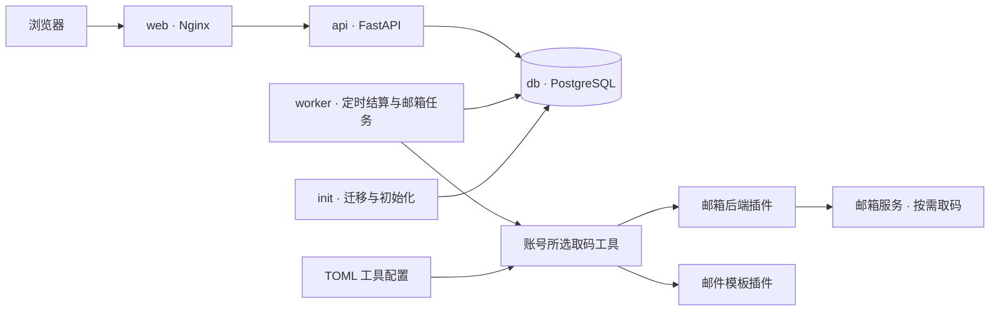

# 架构与开发

## 技术栈

| 层次 | 技术 |
| --- | --- |
| Web UI | React、TypeScript、Ant Design、Vite |
| API | FastAPI、SQLAlchemy、Pydantic |
| 数据库 | PostgreSQL、Alembic |
| 入口与部署 | Nginx、Docker Compose |
| 测试 | pytest、Playwright |

前端依赖由 `frontend/package-lock.json` 固定，Python 依赖由 `backend/requirements-lock.txt` 固定。更新依赖时同步锁文件，完成验证后重新构建镜像。数据库结构和数据格式使用 Alembic 版本化管理，变更时应验证已有数据的升级与回滚。

## 服务架构



`web` 提供静态页面并转发 `/api/`，`api` 处理业务请求，`worker` 每30秒检查到期事件、每秒调度持久化邮箱任务，`init` 在应用启动前执行迁移和首次管理员初始化。只有 `web` 映射宿主机端口。

业务数据、会话和定时任务的时间、版本都保存在 PostgreSQL 中。API 与 worker 不在本地文件中保存业务状态，容器重建不会清空已提交记录。数据库使用独立持久卷；凭据密钥保存在 Compose secret 文件中。

业务写入通过 PostgreSQL 事务锁序列化，并配合行锁、唯一约束及历史记录保证领用与归还的一致性。两种领用名额从记录计算。定时任务可以补处理停机期间到期的事件，新的反馈会先结算过期事件，避免旧任务覆盖新数据。

## REST API

| 入口 | 用途 |
| --- | --- |
| `/api/v1` | 业务 REST API |
| `/api/openapi.json` | OpenAPI 定义 |
| `/api/health` | 进程健康检查 |
| `/api/ready` | 数据库连接及初始化检查 |

已登录用户可通过 `GET /api/v1/account-options` 获取档位、异常类别和默认冷却时长。管理员通过 `GET/PUT /api/v1/settings` 的 `account_options` 管理选项：`tiers` 包含 `id/name/enabled`，`anomaly_categories` 额外包含可空的 `cooldown_hours`。新增时可省略 `id` 由服务端生成；编辑时保留原标识。导入、账号编辑和异常反馈传标识；账号响应的 `tier_name`、`health_category_names` 提供当前显示名。

数据库迁移 `0010` 扩展档位字段并将初始选项写入设置，保留已有账号分类和异常关联。运行时仅读取数据库，不依赖进程缓存。回滚到旧版本前须把所有账号（含已删除记录）的自定义档位迁回旧版本支持的档位，否则迁移会拒绝回滚，避免截断标识或错误改档。回滚会删除选项配置，操作前应备份数据库。

`GET /api/v1/accounts?scope=hall` 返回未停用且未过期的授权账号；默认列表保留停用与过期条目。管理员通过 `PUT /api/v1/accounts/{id}/activation` 和 `{"enabled": false}` 停用账号，使用 `true` 恢复，重复调用不会重复生成状态变更历史。

管理员通过 `GET /api/v1/mail-tools` 获取已注册取码工具的选项和默认值。账号导入、导入预览与编辑支持 `mail_tool`：工具 ID 表示启用，显式 `null` 表示不启用；导入省略该字段使用配置的默认工具，编辑省略该字段保留原值。未知 ID 拒绝写入，账号响应包含 `mail_tool` 与 `mail_tool_name`。普通用户不能修改该字段。

服务端使用基于 Cookie 的会话认证，写请求校验来源及 CSRF。登录密码使用 Argon2id，供应商密码使用 Fernet 加密。凭据响应设置 `Cache-Control: no-store`；导入错误、日志和操作历史不包含供应商密码。

新密码的长度和强度规则集中在 `backend/app/password_policy.py`，覆盖创建、重置、自行改密及首次管理员初始化；历史登录不套用新密码规则。长度为15–72个 Unicode 字符，zxcvbn 分数至少3，并结合用户名和姓名判断。上限沿用估算库的处理限制，避免过长输入导致高开销，不截断密码。评分只在通过鉴权后执行；不记录估算器结果（其中含原始密码）。前端同步校验长度，最终强度由服务端判断。

前端资源按会话版本隔离。检测到登录身份或会话变化时，重建页面子树、清空资源缓存并中止旧请求；旧会话迟到的响应不能重新填充页面。只有同一会话的临时网络失败允许保留最近数据。

### 登录限流

`login_limits.py` 在调用 Argon2 前执行登录准入检查。独立的 PostgreSQL 非阻塞事务锁使所有 API 进程共享一个登录校验名额，忙时直接返回 `429`。密码校验不持业务写锁；校验通过后才获取业务锁、重新读取用户并核对密码哈希和删除状态，防止校验期间的密码重置或用户删除被旧请求绕过。

`login_budget` 只有一行，用下一次计划校验时间实现 GCRA 总量限制，按时间逐步恢复突发额度。用户名失败计数仍保存在 `login_attempts`，键为规范化用户名的摘要。全站预算同时约束真实用户名和不存在的用户名；成功登录也消耗预算。拒绝的请求不运行真实或占位 Argon2 校验，也不新增用户名计数器；`Retry-After` 指示重试间隔。限制和错误响应不依据 `X-Forwarded-For` 等客户端可伪造字段区分用户。

失败计数15分钟过期，新分配的计数器总数上限为1024。登录入口在有可用预算时清理过期行，worker 每30秒尝试清理；两者使用同一登录锁，每批最多删除256行，避免旧版本积压触发一次大事务。后台清理无法立即获得锁时跳过该轮，不阻塞账号定时结算。超过上限的历史表会停止分配新键并逐批收敛，存量有效计数不会因升级被清空。

迁移 `0009` 增加登录预算表与失败计数时间索引，保留既有计数器、用户和会话；降级删除新预算表和索引，原失败计数继续保留。API 与 worker 的资源保护状态均在数据库中，重启不清空已提交限额。部署参数及全站预算的可用性取舍见[部署指南](deployment.md#登录资源保护)。账号限制与错误信息设计参考 [OWASP Authentication Cheat Sheet](https://cheatsheetseries.owasp.org/cheatsheets/Authentication_Cheat_Sheet.html#login-throttling)。

### 登录验证接口

下列路径均以 `/api/v1/accounts/{account_id}` 为前缀。取码要求管理员或当前有效领用者身份；2FA 配置写入仅限管理员；邮箱任务结果仅发起者可读。

| 方法与路径 | 行为 |
| --- | --- |
| `GET /verification` | 账号 2FA 配置状态、取码占用者及截止时间；`email_available` 与 `email_unavailable_reason` 表示取码可用性，`email_config_version` 和 `email_tool_revision` 用于账号或工具配置变更后清除旧结果；不含密钥或验证码 |
| `POST /email-code-runs` | JSON `{"id":"客户端生成的 UUID"}`，创建独占任务；重复请求同 ID 幂等 |
| `GET /email-code-runs/{id}` | 仅发起者查询；成功返回 `code` 与 UTC `received_at` |
| `DELETE /email-code-runs/{id}` | 发起者取消任务并清除结果 |
| `PUT /two-factor/{kind}?version=N` | 仅管理员；请求体为图片原始字节，`kind` 为 `service`；首次版本为0 |
| `DELETE /two-factor/{kind}?version=N` | 仅管理员；取消配置并清除密钥，返回新的配置状态与版本 |
| `GET /two-factor/{kind}/code` | 当前代码、服务端时间、有效期、周期和配置版本 |

2FA 接口当前仅开放目标服务的账号验证类型，邮箱 2FA 不提供配置或取码。写入校验管理员身份和当前配置版本，版本不匹配返回 `409`。上传在解码前检查权限，解码后持写锁再次检查身份和版本。取消后保留递增版本号和空密钥记录，重新配置沿用该版本，防止旧请求覆盖新配置；无配置时取码返回 `404`。界面仅在管理员的“账号管理”中展示设置入口。

邮箱任务用数据库唯一索引实现同账号独占，worker 用有期限的租约防止重复执行。邮箱网络调用不持有数据库事务或业务写锁。候选验证码先加密持久化，再单独标记邮件已读；中断后可从候选恢复，取消任务的候选邮件 ID 保留一天，防止下一位用户收到同一封邮件的代码。任务截止或原登录会话/领用失效后清除结果。

邮箱后端通过通用接口返回未读邮件元数据和原文，模板插件负责匹配及解析。核心层不依赖具体邮箱协议或验证码格式；插件仅在显式注册表中安装，详细接口与扩展步骤见[邮件插件开发](mail-plugins.md)。真实邮箱测试只能在被授权的测试账号上进行，不将原文、Cookie 或验证码复制到夹具。

工具由 TOML 配置组合已注册的邮箱后端和邮件模板，工具层解析配置中的环境变量引用后将参数传给模板工厂。每次任务只使用所选工具的模板。任务绑定工具 ID、实际后端和生效配置摘要；管理员修改工具、邮箱密码或工具定义后，旧任务不再允许标记邮件或发布结果。消息 ID 按账号和实际后端去重，同一后端的不同工具共享去重记录。详细配置和扩展流程见[工具与插件指南](mail-plugins.md)。

迁移 `0005` 同时兼容旧版的服务类型与新安装的通用类型，将账号 2FA 和相关审计标识统一为 `service`，保持密文及版本不变。旧约束和类型映射保存在数据库约束注释中以支持降级，不写入源码；测试覆盖旧数据迁移、取消后的配置、邮箱配置保留和往返降级。

迁移 `0006` 为已有账号和取码任务补全原后端标识，新增账号的默认值由导入 API 提供，数据库中的 `null` 保持关闭语义。降级会取消任务并清除结果后移除后端字段，避免旧代码恢复不同后端的任务。

迁移 `0007` 增加额度自动重置间隔：系统设置 `quota_reset_interval_days` 默认7天，账号同名字段可为空以沿用全局设置；两者均限制为1–365的整数。管理员的批量导入与账号编辑支持覆盖；编辑省略字段保留原值，显式 `null` 清除覆盖。修改间隔不改变已登记的 `reset_at`。到期后以原计划时间为基准按间隔推进，跨越多个周期时一次计算出严格晚于当前时间的下次重置点，只记录一次补处理事件；重启后不会重复处理同一周期。手动反馈可继续覆盖或清除下一次时间。

迁移 `0008` 将账号的 `mail_backend` 改为 `mail_tool`，保留原选择值及空值；取码任务增加工具 ID 和配置摘要，原后端字段继续用于消息去重。旧任务未记录模板配置，因此取消未结束任务及有效结果，保留历史消息 ID。降级关闭账号自动取码，防止工具 ID 被旧应用解释为错误的邮箱后端。

`/api/docs` 提供 Swagger UI；生产 Web 的 CSP 禁止外部脚本，交互式 Swagger UI 应在受控开发环境中直接访问 API，或使用 OpenAPI 文件生成客户端。

## 本地前端开发

需要 Node.js 22 与 npm。先启动测试用后端，再安装前端依赖：

```sh
cd frontend
npm ci
API_TARGET=http://localhost:8080 npm run dev
```

`API_TARGET` 指向已有 Web/API 入口；Vite 将 `/api/` 代理到该地址。在本地 HTTP 开发部署中保持 `PUBLIC_ORIGIN` 为空，避免 HTTPS 来源校验和 Secure Cookie 影响开发登录。不要将开发服务器连接到真实业务数据做写入测试。

开发服务器默认只监听回环地址；需要从容器外调试时，可显式使用 `npm run dev -- --host 0.0.0.0`，并限制端口的访问范围。生产只提供构建后的静态页面。

## 后端测试

先按[部署指南](deployment.md)完成密钥初始化与镜像构建，再执行：

```sh
./ops/test.sh
```

脚本先运行仓库敏感信息检查工具的回归测试，再在当前 Compose 项目的数据库服务中创建独立的 `account_manager_test` 数据库，执行迁移、pytest 和 Ruff；pytest 拒绝操作名称不以 `_test` 结尾的数据库。覆盖并发领用、个人上限、回收与归还竞态、权限、会话、导入原子性、停用与额度阈值、计时恢复，以及邮箱协议、任务租约与取消、2FA 配置权限和版本冲突。

邮箱协议测试使用内存模拟服务，不访问真实邮箱。账号、密码与会话令牌均为虚构数据；TOTP 测试与 `frontend/e2e/totp-fixture.png` 使用公开的 RFC 测试密钥，不可用于真实账号。密码测试覆盖弱密码拒绝、用户名相关输入、Unicode和空格、旧密码登录兼容、拒绝请求不产生部分写入及新密码撤销会话。

登录限流测试使用独立测试数据库、虚构用户名和可控时间，不向生产发送攻击流量。覆盖随机用户名、伪造代理头、总量预算及恢复、成功登录不能重置全局额度、容量上限、旧计数器分批清理、跨连接并发拒绝、业务写入不被慢校验阻塞、密码重置/用户删除竞态，以及迁移往返保留计数与会话。

## 浏览器测试

Playwright 用例包含桌面与移动端项目，部分用例会修改管理员密码、创建用户和账号，必须使用独立部署。

```sh
# 从项目根目录启动独立测试项目；端口可按需修改。
PUBLIC_ORIGIN= HTTP_PORT=8081 COMPOSE_PROJECT_NAME=account-manager-e2e MAIL_TOOLS_CONFIG_PATH= \
  MAIL_CODE_SENDER=noreply@login.example.test MAIL_CODE_SUBJECT_KEYWORD=ExampleService \
  ./ops/compose.sh up -d --no-build --wait

cd frontend
npm ci
npx playwright install --with-deps chromium
npm run build
E2E_BASE_URL=http://localhost:8081 E2E_ALLOW_MUTATIONS=1 \
  E2E_ADMIN_PASSWORD_FILE=../.local/secrets/bootstrap_password npm run test:e2e
```

`E2E_ADMIN_PASSWORD_FILE` 应指向测试部署的当前管理员密码文件。新建测试部署可使用初始化文件；测试会将管理员密码改为夹具定义的固定测试值。截图与跟踪文件写入被忽略的 `test-results/` 目录。

`workflows.spec.ts` 验证真实测试 API 的完整操作流程及新密码规则；其他用例拦截业务 API，使用虚构数据验证筛选与排序、日期时间选择、验证码超时与页面生命周期。`account-options.spec.ts` 覆盖在线配置、动态导入与编辑、异常多选、普通用户筛选及页面重新聚焦后的同步。桌面与移动端均检查管理员维护 2FA、领用者只取码及取消设置后的展示，并验证切换身份时的临时读取失败或旧响应迟到不会保留旧凭据。

## 重启与恢复验证

`ops/verify_runtime.py` 可在独立测试部署执行数据库强制停止、应用重建、到期事件补处理与完整备份恢复：

```sh
PUBLIC_ORIGIN= python3 ops/verify_runtime.py --base-url http://localhost:8081 \
  --project account-manager-e2e --password-file .local/runtime-test-password
```

密码文件应保存测试部署的当前管理员密码。脚本仅接受本地 HTTP 地址和以 `-e2e` 或 `-verify` 结尾的 Compose 项目名，执行时会中断目标测试部署，不能与浏览器测试同时运行。

验收脚本仅为指定测试部署设置虚构邮件匹配规则；在 worker 停止时创建测试任务，并在恢复前将其置为超时，不访问真实邮箱。

验收通过管理员配置账号 2FA、普通领用者读取代码的真实流程，检查容器重建后配置仍可用、过期邮箱任务能结束，以及备份恢复后密码和 2FA 配置仍可解密，同时验证账号工具选择、配置摘要和不启用状态能持久保存、随备份恢复。

## 代码组织

`backend/app/` 放 API、业务规则、模型、认证与 worker，其中 `mail.py` 定义邮箱接口和通用取码流程。`plugins/backends/` 与 `plugins/templates/` 分别放邮箱后端、邮件模板及各自注册表，`plugins/common/` 放共用工具。`plugins/tools.py` 根据 TOML 组装取码工具，顶层 `plugins/__init__.py` 汇总公共调用入口。`backend/migrations/` 放迁移；`frontend/src/` 放界面和 API 客户端。`deploy/` 放镜像与服务配置，`ops/` 放运维工具，`docs/` 放文档。

运维脚本统一通过 `ops/compose.sh` 调用 Compose，避免依赖调用者的工作目录。新增部署配置时使用相对项目路径和环境变量；实际主机、用户名、凭据、私有 CA 与运行数据保存在被忽略的本地文件中。
